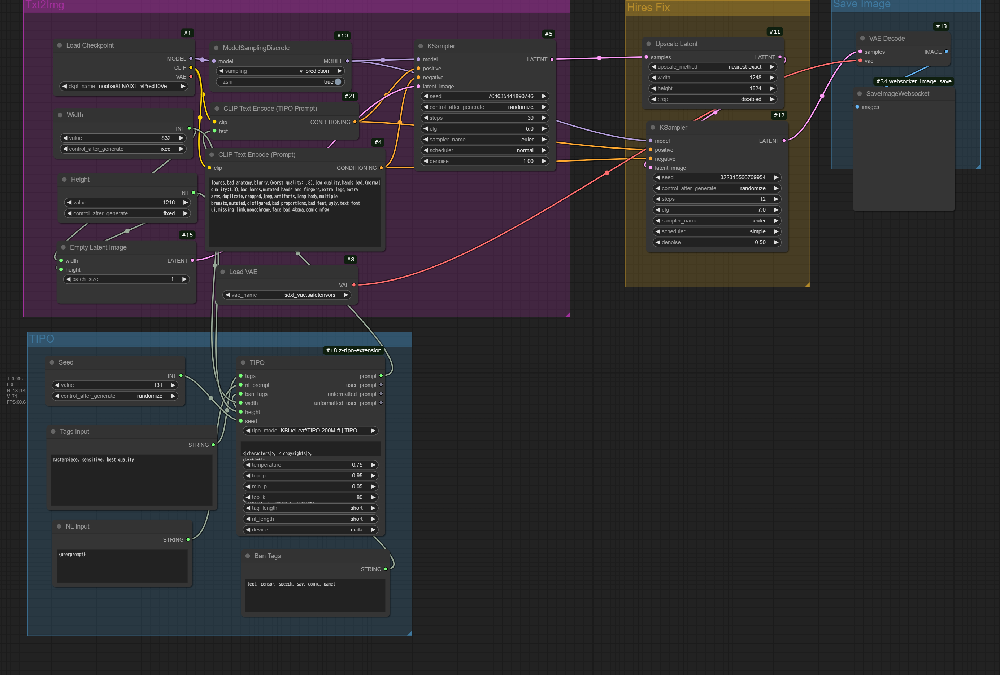

# NoobAI XL V Pred 0.65 Basic

## LandScape(3:2 [1824 x 1248])


## Portait(2:3 [1248 x 1824])


## Setup
- Python 3.12.3
```bash
cd ComfyUI
pip install -r requirements.txt
pip install websocket-client

cd models/checkpoints
wget https://civitai.com/api/download/models/1093948?token=xxxxxxxx --content-disposition

cd models/vae
wget https://huggingface.co/madebyollin/sdxl-vae-fp16-fix/resolve/main/sdxl_vae.safetensors
```

## Example
### LandScape
```bash
time python main.py --mode 1 --prompt "cute angel" --save_path "./test.png"
```
NVIDIA L40S
```
real    0m14.827s
user    0m0.097s
sys     0m0.019s
```

### Portait
```bash
time python main.py --mode 2 --prompt "cute angel" --save_path "./test.png"
```
NVIDIA L40S
```
real    0m14.775s
user    0m0.105s
sys     0m0.011s
```


